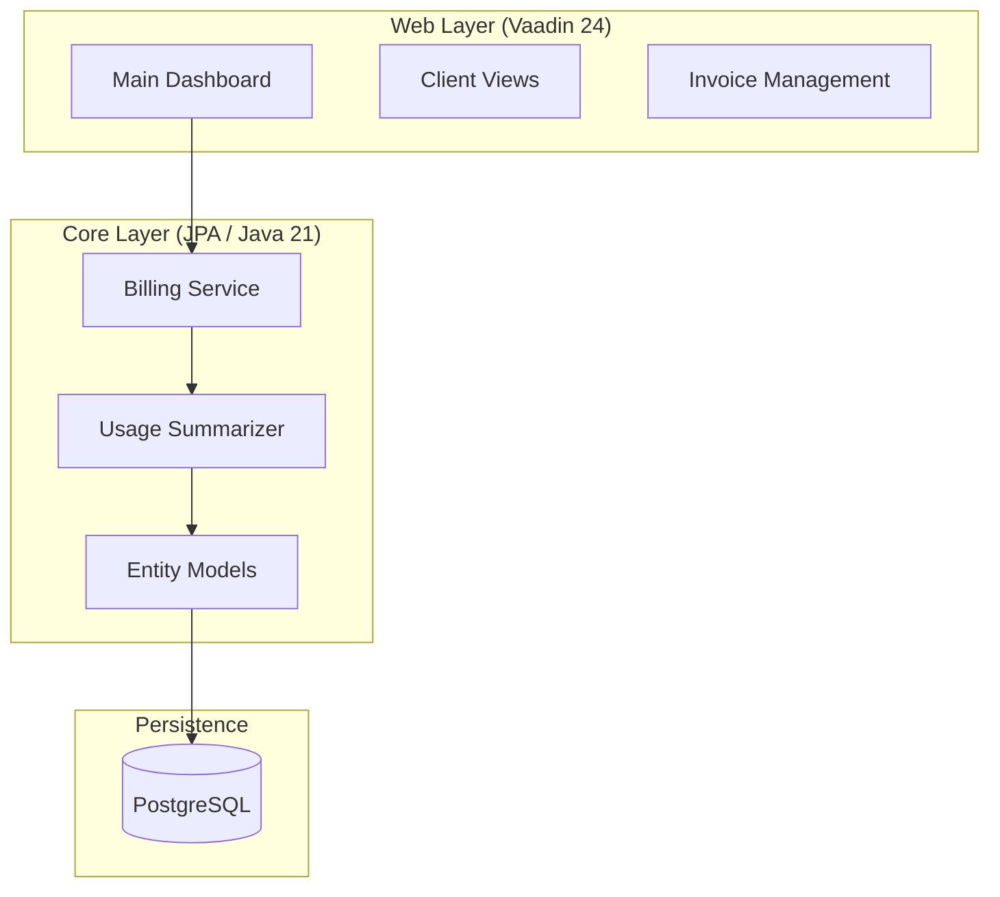

# 🚀 API Billing System

[](https://www.oracle.com/java/technologies/downloads/#java21)
[](https://vaadin.com/)
[](https://www.postgresql.org/)
[](LICENSE)

A premium, enterprise-grade solution for tracking API consumption and managing complex billing cycles. This system provides a robust backend for usage aggregation and a sleek, interactive frontend for administrative oversight.


---

## 🏗 System Architecture

The project utilizes a **decoupled multi-module architecture**, ensuring that business logic remains independent of the presentation layer.



---

## ✨ Key Features

### 💎 Core Engine
- **Granular Usage Tracking**: Captures every API hit with precise timestamps and status codes.
- **Dynamic Pricing**: Support for tiered pricing (e.g., Free, Pro, Enterprise) with custom thresholds.
- **Financial Automation**: Automatically calculates totals, applies taxes, and generates professional PDF-ready invoices.
- **Payment Orchestration**: Built-in support for Card, Bank Transfer, and Digital Wallet reconciliation.

### 🖥 Admin Dashboard
- **Real-time Analytics**: Monitor API traffic and revenue trends at a glance.
- **Client 360**: Full visibility into client accounts, active API keys, and billing history.
- **Subscription Control**: Easy-to-use forms for updating plans and managing rate limits.

---

## 🛠 Tech Stack

| Component | Technology |
| :--- | :--- |
| **Language** | Java 21 (LTS) |
| **Frontend** | Vaadin 24 (Web Components) |
| **ORM** | EclipseLink / Jakarta Persistence |
| **Validation** | Hibernate Validator |
| **Database** | PostgreSQL |
| **Server** | Jetty / Apache Tomcat |

---

## ⚙️ Development Setup

### 1. Database Configuration
The system uses **Jakarta Persistence**. Ensure your PostgreSQL instance is configured:

```xml
<!-- persistence.xml -->
<property name="jakarta.persistence.jdbc.url" value="jdbc:postgresql://localhost:5432/postgres"/>
<property name="jakarta.persistence.jdbc.user" value="postgres"/>
<property name="jakarta.persistence.jdbc.password" value="postgres"/>
```

### 2. Build & Run
From the root directory:

```bash
# Compile and install both modules
mvn clean install

# Launch the Web Dashboard
cd "Vaadin Web Layer"
mvn jetty:run
```

---

## 📂 Project Structure

- `api-usage-core/` - **The Brain**: Contains all entities (`ApiKey`, `ClientAccount`, `Invoice`) and the `BillingService`.
- `vaadin-web-ui/` - **The Face**: Contains the `MainView` and navigable grids for a seamless admin experience.

---

## 📜 License

Distributed under the MIT License. See `LICENSE` for more information.

---
<p align="center">Built with ❤️ for scalable API ecosystems.</p>
